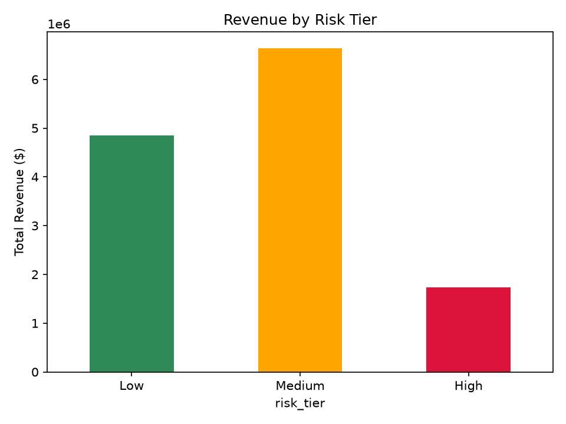
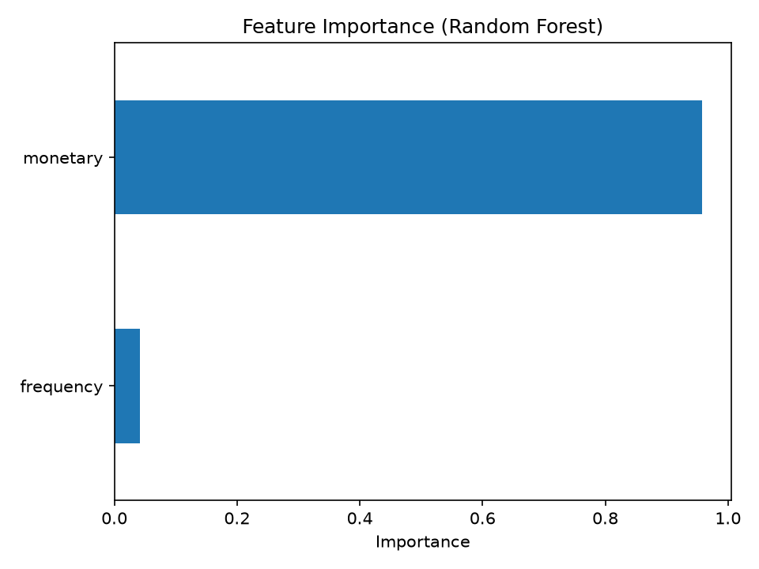
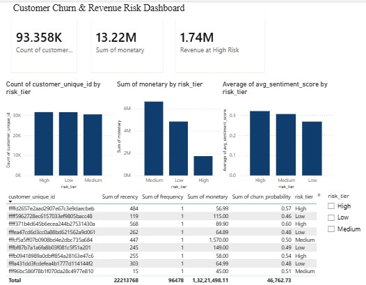

# Customer Churn & Revenue Risk Analysis

End-to-end analysis of e-commerce customer churn, combining RFM-based risk
modeling with NLP sentiment analysis to identify at-risk revenue and inform
retention strategy.

## Business Problem

E-commerce businesses lose revenue when customers stop purchasing, but not all
churn is equal — knowing _which_ customers are at risk and _how much revenue_
they represent lets a business prioritize retention spend instead of guessing.
This project quantifies that risk and layers in customer sentiment to explain it.

## Data

[Olist Brazilian E-Commerce Dataset](https://www.kaggle.com/datasets/olistbr/brazilian-ecommerce)
(Kaggle) — 96,478 delivered orders across 93,358 unique customers, 2016–2018.

## Methodology

1. Cleaned and merged raw order, item, and customer tables
2. Engineered RFM (Recency, Frequency, Monetary) features per customer
3. Defined churn as no purchase within 180 days; built and compared Logistic
   Regression and Random Forest classifiers
4. Scored all customers and assigned risk tiers via quantile ranking
5. Translated a sample of customer reviews and ran sentiment analysis (VADER),
   validated against actual star ratings
6. Merged sentiment with churn risk to test for a relationship
7. Built an interactive Power BI dashboard for business stakeholders

Full technical detail and reasoning in `/notebooks` (run in order, 01–09).

## Key Results

- **Total revenue analyzed:** $13,221,498 across 93,358 customers
- **Revenue in High risk tier:** $1,739,676 (13.2% of total)
- **Baseline churn model:** Random Forest, ROC-AUC 0.56 — RFM alone is a weak
  predictor here since most customers are one-time buyers (see Limitations)
- **Sentiment validation:** translated review sentiment tracked star ratings
  correctly (1-star avg: -0.13, 5-star avg: +0.50), confirming pipeline reliability




## Recommendations

See [RECOMMENDATIONS.md](RECOMMENDATIONS.md) for the full business memo. Headline:
target the $1.74M High-risk segment with win-back campaigns, and invest in richer
churn features (RFM alone is insufficient here).

## Data Governance

See [DATA_GOVERNANCE.md](DATA_GOVERNANCE.md) for the data dictionary and known
limitations — including the customer_id vs customer_unique_id issue and sentiment
coverage constraints.

## Dashboard

Built in Power BI. Live interactivity isn't shareable via link (Power BI Desktop
limitation), so see the screenshot below or open `dashboard/churn_dashboard.pbix`
in Power BI Desktop.



## Tech Stack

Python (pandas, scikit-learn, VADER, deep-translator), Power BI, Git/GitHub

## How to Run

```bash
git clone https://github.com/YASHG0907/churn-revenue-risk.git
cd churn-revenue-risk
python -m venv venv
venv\Scripts\activate
pip install -r requirements.txt
```

Then run notebooks 01–09 in order, or open `dashboard/churn_dashboard.pbix` directly
in Power BI Desktop.

## Author

Yash Ghadi — (https://www.linkedin.com/in/yashg0907/) — yashghadi2005@gmail.com
